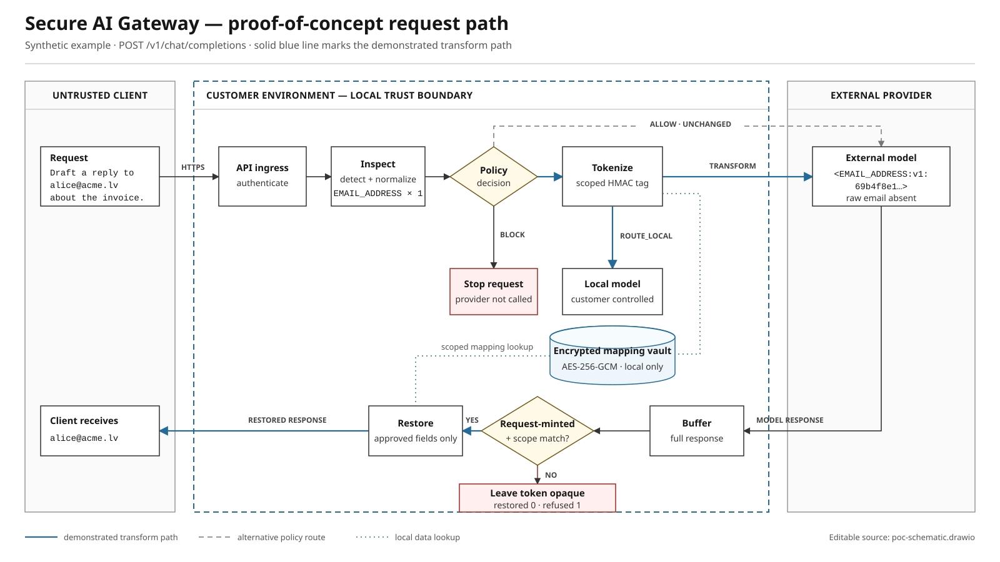

<p align="left">
  
</p>

# Cloakspan

**Send context to the model. Keep identities local.**

Cloakspan is a self-hosted privacy gateway for teams worldwide. It sits between
your app and an OpenAI-compatible model,
detects sensitive values, applies your policy, replaces approved values with
scoped tokens, and restores only tokens created for the same request.

[](#current-limits)
[](pyproject.toml)
[](LICENSE)

Use it for customer support, internal assistants, and other text workflows
where sensitive data needs a policy before it reaches a model. You choose the
infrastructure, model endpoints, and handling rules.

The offline demo prints the exact request seen by a deterministic mock provider
and checks that the gateway refuses to restore a forged token.

[](docs/assets/poc-schematic.svg)

## Why it exists

Plain redaction removes information the model needs. Predictable placeholders
such as `<PERSON_1>` keep some structure, but they are easy to guess or replay.

Cloakspan mints typed HMAC tokens scoped to a tenant and conversation.
Before restoration, it checks that each token came from the current request. A
valid token from another request therefore stays opaque.

```text
app -> authenticate -> inspect -> policy -> tokenize -> provider
app <- restore approved tokens <- check response tokens <- provider
```

Policy has four outcomes: allow unchanged text, transform detected values,
route the request to a local model, or block it before any provider call.

## Try the offline demo

Requirements: Python 3.12 or newer and Git. Installing the dependencies may need
internet access the first time. The demo itself uses a deterministic mock
provider and makes no network requests.

macOS or Linux:

```bash
python3 -m venv .venv
.venv/bin/python -m pip install -e ".[dev]"
.venv/bin/python scripts/demo.py
```

Windows PowerShell:

```powershell
py -3 -m venv .venv
.\.venv\Scripts\python.exe -m pip install -e ".[dev]"
.\.venv\Scripts\python.exe scripts\demo.py
```

If you have GNU Make, `make setup && make demo` runs the same path.

The demo covers email and payment-card tokenization, credential blocking,
a customer dictionary term, and a forged-token restoration attempt. It also
shows a country-specific identifier routed locally using a synthetic Latvian
personal code. It prints exactly what each provider received.

## Connect a client

The gateway implements a strict subset of `POST /v1/chat/completions`. Existing
OpenAI clients can point their base URL at it, provided they stay inside the
[compatibility contract](docs/openai-compatibility.md).

Install the client used in this example with `python -m pip install openai`.

```python
from openai import OpenAI

client = OpenAI(
    base_url="http://127.0.0.1:8080/v1",
    api_key="sgw_live_your_gateway_key",
    default_headers={"X-Conversation-Id": "case-42"},
)

reply = client.chat.completions.create(
    model="your-model",
    messages=[{"role": "user", "content": "Email alex@example.com"}],
)
```

For a configured deployment, copy `.env.example` to `.env`, set independent
secrets and provider URLs, then run:

```bash
docker compose config
docker compose up -d
curl -fsS http://127.0.0.1:8080/readyz
```

Compose binds to loopback by default. Put a TLS reverse proxy in front of it if
you expose it beyond the host. See [configuration](docs/configuration.md) before
changing the egress or private-network settings.

## What it catches

| Category | Included detectors |
|---|---|
| Personal and financial data | Email, IPv4, IBAN with mod-97, payment cards with Luhn |
| Country-specific identifiers | Latvian, Lithuanian, and Estonian personal codes; checksum validation where the format supports it |
| Phone numbers | Contextual international E.164 numbers and national formats for Latvia, Lithuania, and Estonia |
| Credentials | AWS keys, private keys, JWTs, OpenAI and Anthropic keys, GitHub and Slack tokens |
| Customer data | Exact dictionary terms and reviewed custom regular expressions |
| Optional NER | PERSON, ORG, LOCATION, and ADDRESS through a checksum-verified local model supplied by the operator |

Deterministic detectors work without model downloads. The evaluation harness
reports precision and recall per entity and language against versioned synthetic
corpora. The [evaluation report](docs/evaluation-report.md) lists the sample
sizes, results, and coverage boundaries.

### Global use, explicit coverage

The gateway is not tied to a country or model host. Email, payment-card,
credential, and customer-defined detection can be used across markets; IBAN
detection applies where that banking standard is used. Country-specific
identifiers need dedicated recognizers, and language-aware detection depends
on your configured NER model.

Built-in national ID coverage currently covers Latvia, Lithuania, and Estonia.
Other national IDs are not detected out of the box. Validate the entity types,
languages, and policies your deployment needs against representative data;
the current synthetic evaluation is not evidence of worldwide detection
coverage. Contributions for additional countries and languages are welcome.

## Security choices

- Request fields are allowlisted. Unsupported roles, tools, structured output,
  `stop`, `user`, streaming, and multimodal content are refused rather than
  forwarded without inspection.
- Request bodies are capped while streaming, before JSON parsing. Inspected text
  has a separate CPU-cost limit.
- Token tags use HMAC-SHA256 with a 128-bit tag. The local mapping vault uses
  AES-256-GCM and binds tenant, conversation, token, and key version as
  authenticated data.
- Provider responses are buffered. Restoration writes only to
  `choices[].message.content` and only for tokens minted during that request.
- Audit events contain decisions, counts, timing, and refusal reasons. Their
  schema has no field for raw prompts.
- Provider destinations are fixed at startup and revalidated off the event loop
  on every request. Ambient proxy variables are ignored unless explicitly
  enabled.

Tests cover adversarial inputs, token properties, data leakage, policy, egress,
and vault behavior. Read the [threat model](docs/threat-model.md) and
[security invariants](docs/security-invariants.md) before relying on a claim.

## Current limits

The current build supports local evaluation and synthetic-data pilots. Its
boundaries are explicit:

- PERSON, ORG, LOCATION, and ADDRESS detection needs an operator-supplied NER
  model. No model artifact ships in this repository.
- Streaming, tool calls, structured output, multimodal input, and broad OpenAI
  API compatibility are intentionally unsupported.
- The default vault is process-local. Mappings disappear on restart and do not
  support a multi-node deployment.
- Detector execution has no hard timeout, and custom regular expressions must
  be treated as trusted configuration.

The full, current list is in [known limitations](docs/limitations.md). Report a
vulnerability privately using [SECURITY.md](SECURITY.md); do not open a public
issue with exploit details or real customer data.

## Project map

Previously named **Secure AI Gateway**. The Python distribution, container
names, `secure-ai-gateway` command, `SAG_*` settings, and `sgw_live_` key prefix
retain their existing identifiers for compatibility. New installations also
provide the `cloakspan` command. See the [brand assets](docs/brand.md).

| Need | Start here |
|---|---|
| Configure and deploy | [Configuration](docs/configuration.md) and [operations](docs/operations.md) |
| Check client compatibility | [OpenAI compatibility contract](docs/openai-compatibility.md) |
| Review the security model | [Threat model](docs/threat-model.md), [invariants](docs/security-invariants.md), and [data flow](docs/data-flow.md) |
| Inspect detection evidence | [Evaluation report](docs/evaluation-report.md) and [entity taxonomy](docs/entity-taxonomy.md) |
| Contribute | [Contributing guide](CONTRIBUTING.md) and [roadmap](ROADMAP.md) |

## Local checks

After `make setup`:

```bash
make test
make lint
make benchmark

# Detection and available security checks
make evals
make security

# Source-side release inputs
make sbom
make licences
```

With the environment created by `make setup`, `make security` runs Ruff's
security rules, audits the locked Python dependencies through the virtualenv's
`pip-audit`, and runs the licence-boundary tests. It also runs Gitleaks and
Trivy when those commands are available. A missing external scanner is reported
and skipped. A finding or error from a scanner that does run fails the target.

`make sbom` covers the source tree. GitHub Actions also produces a container
SBOM and Trivy report, runs the container hardening tests, and signs and attests
tagged releases.

Recognizer contributions are especially useful when they cite a published
identifier format, validate its checksum, and include both positive and boundary
cases. See [CONTRIBUTING.md](CONTRIBUTING.md).

## License

Apache-2.0. See [LICENSE](LICENSE) and [THIRD_PARTY_NOTICES.md](THIRD_PARTY_NOTICES.md).
