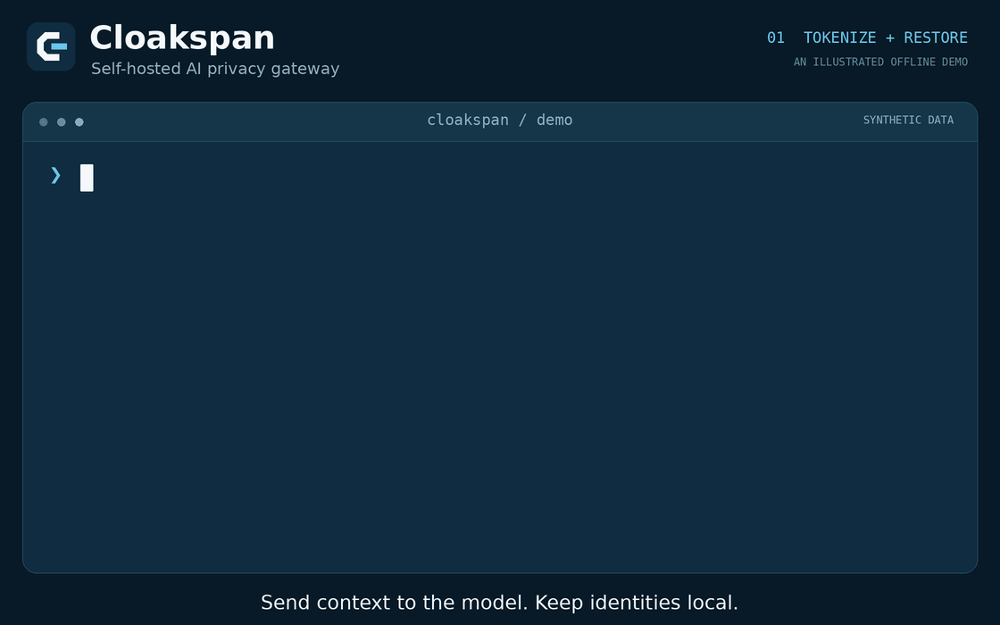
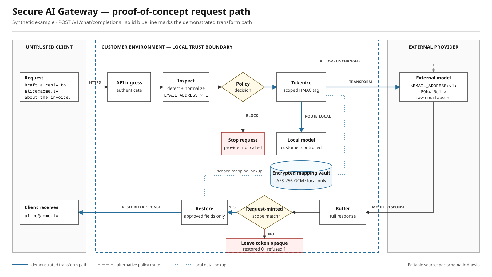

<p align="left">
  <picture>
    <source media="(prefers-color-scheme: dark)" srcset="docs/assets/cloakspan-logo-dark.svg">
    
  </picture>
</p>

# Cloakspan

**Send context to the model. Keep identities local.**

Cloakspan runs on your own server and hides detected sensitive details before
your app sends text to an AI model. For example, it replaces an email address
with a placeholder, then puts the address back if that placeholder appears in
the model's reply.

**[Try it locally](#try-it-locally)** ·
[Watch the terminal demo](#try-the-offline-demo) ·
[Connect your app](#connect-a-client) ·
[Releases](https://github.com/quiethours-eu/cloakspan/releases)

[](https://github.com/quiethours-eu/cloakspan/actions/workflows/ci.yml)
[](#current-limits)
[](pyproject.toml)
[](LICENSE)



Synthetic example: your app sends `alex@example.com`; the model sees a scoped
token; Cloakspan restores the address when an approved token appears in the
reply. The illustration uses a deterministic mock provider.

## Try it locally

See which values Cloakspan detects and what it would send, using the local
browser playground. **No API key, model download, Docker, or provider account
is needed.** Installation needs internet access; inspection runs offline.

Requirements: **Python 3.12 or newer** and **Git**. Start in a directory where
you want to keep the project.

macOS or Linux:

```bash
git clone https://github.com/quiethours-eu/cloakspan.git
cd cloakspan
python3 -m venv .venv
.venv/bin/python -m pip install .
.venv/bin/cloakspan playground
```

Windows PowerShell:

```powershell
git clone https://github.com/quiethours-eu/cloakspan.git
cd cloakspan
py -3 -m venv .venv
.\.venv\Scripts\python.exe -m pip install .
.\.venv\Scripts\cloakspan.exe playground
```

Open **http://127.0.0.1:8765** and enter the session access code printed in the
terminal. Choose the **Email address** sample, then **Inspect locally**. The result
shows `TRANSFORM`: the original address is highlighted, and the projected
request contains an `EMAIL_ADDRESS` token instead of the address. Try the
credential sample to see a blocked request. Press **Ctrl+C** in the terminal
to stop the playground.

The playground previews inspection and routing; it does not call a model or
simulate response restoration. The [offline demo](#try-the-offline-demo) below
shows restoration too. For another port or custom settings, see the
[playground guide](docs/local-privacy-playground.md).

This is an **alpha for local evaluation and synthetic-data pilots**. See the
[current limits](#current-limits) before connecting a real workflow.

## Where it fits

Use it for customer support, internal assistants, and other text workflows
where you need to control what reaches a model. You run the infrastructure and
choose the model endpoints and handling rules. Custom filters work with your
own data formats, regardless of country.

Some data shouldn't leave the building even in disguise. Turn on
[GDPR mode](#gdpr-mode-keep-personal-data-on-your-own-model) and any request
with detected personal data is answered by a model you host instead.

The offline demo prints the exact request seen by a deterministic mock provider
and checks that the gateway refuses to restore a forged token.

[](docs/assets/poc-schematic.svg)

## Why it exists

Plain redaction removes information the model needs. Predictable placeholders
such as `<PERSON_1>` keep some structure, but they are easy to guess or replay.

Cloakspan mints typed HMAC tokens scoped to a tenant and conversation.
Before restoration, it checks that each token came from the current request. A
valid token from another request therefore stays opaque.

```text
app -> authenticate -> inspect -> policy -> tokenize -> provider
app <- restore approved tokens <- check response tokens <- provider
```

Policy has four outcomes: allow unchanged text, transform detected values,
route the request to a local model, or block it before any provider call.

## Try the offline demo

After the [local setup](#try-it-locally), run this from the `cloakspan` directory.
If the playground is running, stop it with **Ctrl+C** first. The demo uses a
deterministic mock provider and makes no network requests.

macOS or Linux:

```bash
.venv/bin/python scripts/demo.py
```

Windows PowerShell:

```powershell
.\.venv\Scripts\python.exe scripts\demo.py
```

If you have GNU Make, `make demo` runs the same demo after setup. Contributors
can use `make setup` to install the additional development tools.

The demo covers email and payment-card tokenization, credential blocking,
a customer dictionary term, and a forged-token restoration attempt. It also
shows a country-specific identifier routed locally using a synthetic Latvian
personal code. It prints exactly what each provider received.

### Setup help

Run `.venv/bin/cloakspan doctor` on macOS/Linux, or
`.\.venv\Scripts\cloakspan.exe doctor` on Windows, to inspect gateway settings
without starting the gateway. Provider and secret warnings are expected for
the provider-free playground; configure them when you connect an app.

See the [setup doctor guide](docs/setup-doctor.md) for JSON output, optional
model and provider checks, and Compose commands.

## Connect a client

**Using Codex or Claude Code CLI?** Follow the
[simple connection guide](docs/connect-coding-clients.md) for gateway-key setup
and commands for both pinned clients. The opt-in Responses and native Messages
profiles passed synthetic coding, automatic inspectable compaction and resume.
See the [coding agent contract](docs/agent-compatibility.md) for live/desktop
qualification limits; opaque continuation remains disabled.

The gateway implements a strict subset of `POST /v1/chat/completions`. Existing
OpenAI clients can point their base URL at it, provided they stay inside the
[compatibility contract](docs/openai-compatibility.md).

Install the client used in this example with `python -m pip install openai`.

```python
from openai import OpenAI

client = OpenAI(
    base_url="http://127.0.0.1:8080/v1",
    api_key="sgw_live_your_gateway_key",
    default_headers={"X-Conversation-Id": "case-42"},
)

reply = client.chat.completions.create(
    model="your-model",
    messages=[{"role": "user", "content": "Email alex@example.com"}],
)
```

For a configured deployment, copy `.env.example` to `.env`, set independent
secrets and provider URLs, then run:

```bash
docker compose config
docker compose up -d
curl -fsS http://127.0.0.1:8080/readyz
```

Compose binds to loopback by default. Put a TLS reverse proxy in front of it if
you expose it beyond the host. See [configuration](docs/configuration.md) before
changing the egress or private-network settings.

## GDPR mode: keep personal data on your own model

Some GDPR assessments end with a flat rule: personal data does not go to a
third-party model, not even as a placeholder. GDPR mode turns that rule into one
setting. When Cloakspan finds personal data in a request, a model you host
answers it. The external provider only sees requests with nothing detected in
them, or nothing at all if you choose `all`.

| The request contains | `SAG_LOCAL_ROUTING=detected` | `SAG_LOCAL_ROUTING=all` |
|---|---|---|
| An email address, IBAN, name, or anything else a detector or filter finds | your model | your model |
| Nothing any detector finds | the external provider | your model |
| A credential, or anything else your policy blocks | blocked | blocked |

The quickest start is `all`, which works with the Docker image as shipped. Add
this to `.env`:

```bash
SAG_LOCAL_ROUTING=all
SAG_LOCAL_BASE_URL=http://host.docker.internal:11434/v1
SAG_LOCAL_MODEL=your-local-model
```

Every request that isn't blocked now goes to your model, and the gateway never
creates a client for the external provider. The URL is Ollama on the Docker
host. vLLM, llama.cpp's server, and other OpenAI-compatible `/v1` endpoints work
the same way. `SAG_LOCAL_MODEL` replaces the model name your app sends, so the
same client code keeps working.

To keep the external provider for requests with nothing personal in them, use
`SAG_LOCAL_ROUTING=detected`. It needs an NER model in `SAG_NER_MODEL_PATH`,
because without one a name looks like ordinary text, and the gateway won't start
in that mode until it has one. The Docker image doesn't include the NER runtime,
so `detected` needs an install with the `[ner]` extra. The
[configuration guide](docs/configuration.md#gdpr-mode-sag_local_routing) covers
that setup.

In both modes your model receives placeholders instead of the detected values,
and Cloakspan restores them in the reply as usual. The mode is enforced in code,
on top of your policy and filters:

- Blocking works as before. A credential, or anything a rule or filter blocks,
  is refused before any model sees it.
- No rule or filter can send a request with a detection anywhere except your
  model.
- `SAG_LOCAL_BASE_URL` must resolve to loopback or a private network, including
  Tailscale's 100.64.0.0/10 range. The address is checked at startup and again
  on every request, and proxy variables are ignored for it.
- When your model is down, the request fails. It is never retried against the
  external provider.

To confirm it's on, look for the startup log line that names the mode. Each
successful response also shows how it was routed. A request the mode sent to
your model comes back with:

```text
X-Policy-Decision: route_local
X-Policy-Rule: local-routing:all
X-Policy-Version: community-default-v1+local-routing:all
```

`detected` routes what the detectors find. A date of birth or an ID from a
country without a recognizer can pass as clean text and reach the external
provider. When that would be a problem, use `all`.

## What it catches

| Category | Included detectors |
|---|---|
| Personal and financial data | Email, IPv4, IBAN with mod-97, payment cards with Luhn |
| Country-specific identifiers | Latvian, Lithuanian, and Estonian personal codes; checksum validation where the format supports it |
| Phone numbers | Contextual international E.164 numbers and national formats for Latvia, Lithuania, and Estonia |
| Credentials | AWS keys, private keys, JWTs, OpenAI and Anthropic keys, GitHub and Slack tokens |
| Customer data | Unified YAML filters with dictionary/regex matching and transform, block, or local-routing actions |
| Optional NER | PERSON, ORG, LOCATION, and ADDRESS through a checksum-verified local model supplied by the operator |

Deterministic detectors work without model downloads. The evaluation harness
reports precision and recall per entity and language against versioned synthetic
corpora. The [evaluation report](docs/evaluation-report.md) lists the sample
sizes, results, and coverage boundaries.

### Add custom filters

Put your matching rules and actions in one YAML file. For example, this file
replaces employee IDs with tokens and blocks requests containing a confidential
project name:

```yaml
version: 1
filters:
  - name: employee-ids
    entity_type: EMPLOYEE_ID
    match:
      type: regex
      pattern: '\bEMP-[0-9]{6}\b'
    action: transform

  - name: confidential-projects
    entity_type: CONFIDENTIAL_PROJECT
    match:
      type: dictionary
      terms: [Project Aurora, Project Meridian]
    action: block
```

Save it as `filters.yaml`, set `SAG_FILTERS_PATH` to that file's path, and restart
the gateway. Docker deployments need the file mounted inside the container.
Each filter creates its detector and policy rule, so you do not need to edit
Python code or add a separate policy entry.

Filters also support `route_local`, case sensitivity, priority, and an `enabled`
switch. They run alongside the built-in detectors and existing custom settings.
The highest-priority matching policy rule decides how the whole request is
handled. Invalid filter files stop startup.

See the [example filters](deployment/filters/example.yaml) and
[configuration guide](docs/configuration.md#unified-custom-filters) for defaults,
rule precedence, and Docker setup.

### Country and language coverage

The gateway is not tied to a country or model host. Email, payment-card,
credential, and customer-defined detection can be used across markets; IBAN
detection applies where that banking standard is used. Country-specific
identifiers need a matching custom filter or dedicated recognizer. Regex filters
match a format; they do not validate a country's checksum. Language-aware
detection depends on your configured NER model.

Built-in national ID coverage currently covers Latvia, Lithuania, and Estonia.
Other national IDs are not detected out of the box. Validate the entity types,
languages, and policies your deployment needs against representative data;
the current synthetic evaluation is not evidence of worldwide detection
coverage. Contributions for additional countries and languages are welcome.

## Security choices

- Chat Completions request fields are allowlisted. Unsupported roles, tools, structured output,
  `stop`, `user`, streaming, and multimodal content are refused rather than
  forwarded without inspection.
- Request bodies are capped while streaming, before JSON parsing. Inspected text
  has a separate CPU-cost limit.
- Token tags use HMAC-SHA256 with a 128-bit tag. The local mapping vault uses
  AES-256-GCM and binds tenant, conversation, token, and key version as
  authenticated data.
- Chat Completions provider responses are buffered. Restoration writes only to
  `choices[].message.content` and only for tokens minted during that request.
- Opt-in agent adapters inspect typed content, validate native SSE and restore
  registered tool batches only after completion and full validation.
- Audit events contain decisions, counts, timing, and refusal reasons. Their
  schema has no field for raw prompts.
- Provider destinations are fixed at startup and revalidated off the event loop
  on every request. Ambient proxy variables are ignored unless explicitly
  enabled.

Tests cover adversarial inputs, token properties, data leakage, policy, egress,
and vault behavior. The [threat model](docs/threat-model.md) and
[security invariants](docs/security-invariants.md) describe what these controls
protect and where they stop.

## Current limits

The current build supports local evaluation and synthetic-data pilots:

- PERSON, ORG, LOCATION, and ADDRESS detection needs an operator-supplied NER
  model. No model artifact ships in this repository.
- Default Chat Completions streaming, tool calls and structured output remain
  unsupported. Opt-in agent adapters support the registered text/tool/SSE subset;
  multimodal input, opaque continuation and broad API compatibility remain unsupported.
- The default vault is process-local. Mappings disappear on restart and do not
  support a multi-node deployment.
- Chat Completions detector execution has no hard timeout. Native agent
  inspection has an isolated-process deadline; custom regular expressions remain
  trusted configuration.

The full, current list is in [known limitations](docs/limitations.md). Report a
vulnerability privately using [SECURITY.md](SECURITY.md); do not open a public
issue with exploit details or real customer data.

## Project map

Previously named **Secure AI Gateway**. The Python distribution, container
names, `secure-ai-gateway` command, `SAG_*` settings, and `sgw_live_` key prefix
retain their existing identifiers for compatibility. New installations also
provide the `cloakspan` command. See the [brand assets](docs/brand.md).

| Need | Start here |
|---|---|
| Configure and deploy | [Configuration](docs/configuration.md) and [operations](docs/operations.md) |
| Check client compatibility | [OpenAI compatibility contract](docs/openai-compatibility.md) |
| Review the security model | [Threat model](docs/threat-model.md), [invariants](docs/security-invariants.md), and [data flow](docs/data-flow.md) |
| Inspect detection evidence | [Evaluation report](docs/evaluation-report.md) and [entity taxonomy](docs/entity-taxonomy.md) |
| Contribute | [Contributing guide](CONTRIBUTING.md) and [roadmap](ROADMAP.md) |

## Local checks

After `make setup`:

```bash
make test
make lint
make benchmark

# Detection and available security checks
make evals
make security

# Source-side release inputs
make sbom
make licences
```

With the environment created by `make setup`, `make security` runs Ruff's
security rules, audits the locked Python dependencies through the virtualenv's
`pip-audit`, and runs the licence-boundary tests. It also runs Gitleaks and
Trivy when those commands are available. A missing external scanner is reported
and skipped. A finding or error from a scanner that does run fails the target.

`make sbom` covers the source tree. GitHub Actions also produces a container
SBOM and Trivy report, runs the container hardening tests, and signs and attests
tagged releases.

Recognizer contributions are especially useful when they cite a published
identifier format, validate its checksum, and include both positive and boundary
cases. See [CONTRIBUTING.md](CONTRIBUTING.md).

## License

Apache-2.0. See [LICENSE](LICENSE) and [THIRD_PARTY_NOTICES.md](THIRD_PARTY_NOTICES.md).
