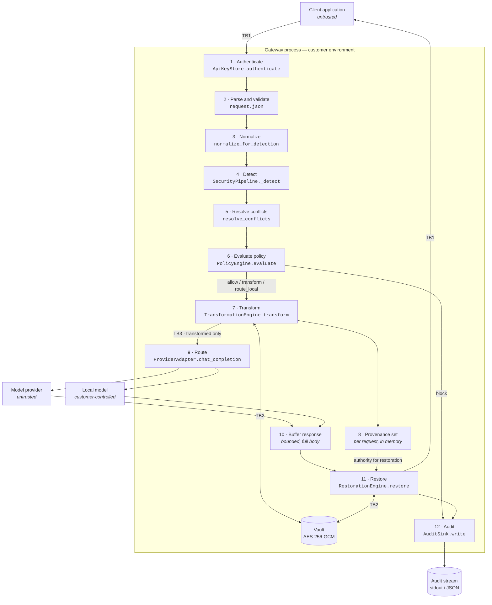

# Request and Response Data Flow

**Status:** FROZEN for v1 · 2026-08-03

The complete path a request takes, the trust boundary it crosses at each hop, the
named function that inspects it, and what happens when that stage fails.

This document exists so an auditor can answer one question without reading Python:
*where, exactly, does customer data stop being customer-controlled and start being
gateway-controlled?*

---

## The path

## Trust boundaries

| ID | Boundary | Property that must hold |
|---|---|---|
| **TB1** | Client ↔ gateway | Client input is attacker-controlled, always. Every field is either inspected or refused ([SI-01](security-invariants.md#si-01--no-uninspected-egress), [SI-02](security-invariants.md#si-02--reject-unknown-content)) |
| **TB2** | Gateway ↔ vault | The highest-value internal boundary. Crossing it requires an authenticated `RequestContext`, and isolation is cryptographic rather than control-flow ([SI-04](security-invariants.md#si-04--authenticated-scope-on-every-vault-and-restoration-call), [SI-05](security-invariants.md#si-05--cross-tenant-isolation-is-cryptographic-not-control-flow)) |
| **TB3** | Gateway → provider | **The boundary the product exists to defend.** Only transformed text crosses it, only to an explicitly configured destination ([SI-01](security-invariants.md#si-01--no-uninspected-egress), [SI-14](security-invariants.md#si-14--explicit-egress)) |
| **TB4** | Gateway → control plane | Cloud Edition only. Metadata only, never raw prompts, never on the critical path ([SI-15](security-invariants.md#si-15--no-control-plane-dependency-on-the-request-path)). **The Community Edition has no TB4 at all** |

---

## Stage by stage

### 1 · Authenticate

| | |
|---|---|
| **Function** | `ApiKeyStore.authenticate` ([app.py:95](../gateway/api/app.py)) |
| **Input** | `Authorization: Bearer <key>` |
| **Output** | `ApiKey` → `RequestContext(tenant_id, conversation_id, request_id, api_key_id, application)` |
| **Failure** | 401 `invalid_api_key`. No audit event |
| **Invariants** | SI-04 — every downstream vault call is scoped by the context created here |

The tenant id on the key becomes the vault scope. `X-Conversation-Id` sets the
conversation scope; **when absent a fresh id is generated**, so tokens from a
previous turn will not restore.

### 2 · Parse and validate

| | |
|---|---|
| **Function** | `parse_chat_completion_request` ([schema.py](../gateway/api/schema.py)) |
| **Output** | A validated `ChatCompletionRequest`; the outbound payload is rebuilt from it |
| **Failure** | 400 for non-JSON, non-object, or `stream`; 403 for a model the key is not scoped to; 422 with `unknown_field`, `uninspectable_field`, `unsupported_role`, or `inspection_failed` |
| **Invariants** | SI-01, SI-02 |

Reject-unknown, enforced by `extra="forbid"`. The outbound payload is rebuilt
from validated fields rather than copied from the client's body, so a key that is
not a field on the model is not carried anywhere — it cannot reach the provider
even if a future change forgets to reject it.

### 3 · Normalize

| | |
|---|---|
| **Function** | `screen_text` then `build_detection_view` (`gateway/normalization/`) |
| **Input** | `messages[i].content` for roles in `INSPECTED_INPUT_ROLES` |
| **Output** | A `DetectionView`: the normalized `text`, the confusable-folded `folded` (same length), and `origins` — one original range per view character |
| **Failure** | `SuspiciousEncodingError` → 422 for bidi controls or dense invisible padding, with a reason code and **no content** |
| **Invariants** | SI-17, SI-11 |

Order is fixed: drop ignorables, NFKC **per cluster** so decomposed input
composes, then fold confusables. Screening runs first, because refusing a
deceptive encoding is a decision about the encoding rather than about what was
found in it.

**The original is what continues down the pipeline and what is sent to the
provider.** The view exists only to detect on; spans found in it are mapped back
at stage 5. Every original index is covered by the map, so forwarding unchanged
bytes does not mean forwarding unscanned bytes.

### 4 · Detect

| | |
|---|---|
| **Function** | `SecurityPipeline._detect` ([pipeline.py:110](../gateway/inspection/pipeline.py)) |
| **Output** | `list[Span]`, offsets relative to the normalized text of **one** message |
| **Failure** | **Any** detector exception → `DetectionError` → 422, request never forwarded |
| **Invariants** | SI-10 |

The exception message names the detector and the exception type, never the text
being scanned (SI-11). Detector *timeouts* are not implemented: a hanging
detector blocks until the client gives up.

### 5 · Resolve conflicts, then map back to the original

| | |
|---|---|
| **Function** | `resolve_conflicts`, then `SecurityPipeline._map_to_original` |
| **Scope** | **Per message, never across the aggregate.** Offsets are only meaningful relative to one string — two messages each with an entity at 5..15 are not overlapping, and a global resolve would silently drop one. That would be a detection bypass, so the per-message structure is load-bearing |
| **Output** | Non-overlapping spans in **original** coordinates, each carrying the original bytes |
| **Failure** | `DetectionError` → 422 if a span cannot be mapped, or if the round trip fails |

Conflict resolution runs **twice**: once in view coordinates, and again after
mapping. Two spans that did not overlap in the view can overlap once dropped
characters are absorbed into their ranges, and replacing overlapping spans would
corrupt the text.

Three checks stand between a mapping and a replacement — bounds, non-overlap,
and a round trip that re-views the mapped original and compares it with what the
detector matched. A failure raises rather than dropping the span: dropping it
would forward an entity we detected, and clamping it would replace bytes we did
not choose.

### 6 · Evaluate policy

| | |
|---|---|
| **Function** | `PolicyEngine.evaluate` ([policy/engine.py:80](../gateway/policy/engine.py)) |
| **Input** | The **aggregate** span list — entity types and counts only, never offsets |
| **Output** | `PolicyDecision(action, destination, rule_name, policy_version)` |
| **Failure** | No rule matches → implicit `BLOCK` ([policy/engine.py:94](../gateway/policy/engine.py)). Unreachable with a well-formed policy, because the loader requires a catch-all rule |
| **Invariants** | SI-10, SI-13 |

Rules sort by (priority desc, BLOCK first, name asc) — deny-overrides is a
property of the ordering, not a special case. `BLOCK` writes its audit event
**before** raising ([pipeline.py:186](../gateway/inspection/pipeline.py)), then
returns 403 `blocked_by_policy`.

### 7 · Transform

| | |
|---|---|
| **Function** | `TransformationEngine.transform` ([transformations/engine.py:39](../gateway/transformations/engine.py)) |
| **Applies to** | `TRANSFORM` and `ROUTE_LOCAL` only. `ALLOW` forwards the client's original bytes unchanged (SI-17) |
| **Method** | Span-based, **right to left**. Never `str.replace` — replacing by value corrupts text that was never detected |
| **Side effects** | Mints a token per span, writes `token → original value` to the vault (TB2), records the token in the provenance set |
| **Failure** | `TokenCollisionError` if two distinct values produce one tag → 500. Refuse rather than silently restore the wrong person's data |
| **Invariants** | SI-06, SI-07, SI-08 |

Right-to-left replacement means every earlier span's offsets stay valid — no
recomputation, no drift, no off-by-one.

### 8 · Provenance

| | |
|---|---|
| **Object** | `TokenProvenance`, created in `process` ([pipeline.py:180](../gateway/inspection/pipeline.py)) |
| **Lifetime** | One request. In memory. Never persisted, never shared, never reachable from another request |
| **Role** | **The authority for restoration.** Stage 11 consults this before the vault |
| **Invariants** | SI-03, SI-16 |

This is the object that closes the replay path. The vault legitimately holds
tokens from earlier turns in the same conversation; provenance narrows the trust
window from "this conversation" to "this request", which is the smallest scope
that still works.

### 9 · Route

| | |
|---|---|
| **Function** | `ProviderAdapter.chat_completion` ([routing/base.py:122](../gateway/routing/base.py)) |
| **Destination** | Selected **by name** from a fixed map built at startup. An unknown name is a 500, not a fetch |
| **Egress** | `EgressPolicy` validates scheme, host allowlist, and every resolved address — at startup and again per request. Loopback, link-local, private, reserved and multicast refused unless the destination is `local` |
| **Client** | httpx with `trust_env=False`, explicit TLS verification, redirects not followed, response capped at 8 MiB |
| **Retry** | Connection errors, 429, and 5xx (not 501) retried up to twice with full-jitter backoff under a **total** deadline. Timeouts are **not** retried — no idempotency key, so a retry risks a duplicate billed completion |
| **Failure** | Timeout → 504; transport error → 502; upstream ≥400 → 502 or the upstream status. **Never** `str(exc)`, and the error body is not read at all |
| **Invariants** | SI-12, SI-14, SI-16 |

**This is TB3.** Everything crossing it has been detected, policy-evaluated, and
(where policy said so) tokenised.

### 10 · Buffer response

| | |
|---|---|
| **Method** | Buffered and size-bounded. The full body is read before anything is returned |
| **Failure** | Oversized, non-JSON, or non-object response → `ProviderError` |

Streaming is refused at stage 2 so token-shaped text cannot be emitted before
the restoration allowlist and per-request provenance check have run over the
complete response.

⚠️ General sensitive-data detection is **not** run on provider output. Restoration
scans only token-shaped values in `choices[].message.content`; a model that
invents a plausible personal code is not blocked (T16).

### 11 · Restore

| | |
|---|---|
| **Function** | `RestorationEngine.restore` ([restoration/engine.py:61](../gateway/restoration/engine.py)) |
| **Scope** | `choices[].message.content` only ([pipeline.py:53](../gateway/inspection/pipeline.py)). Restoring into a tool-call name or an id would let a model rewrite control data, not just prose |
| **Invariants** | SI-03, SI-05 |

A token is restored **only if all four hold**:

1. It parses as `<ENTITY_TYPE:16-hex>`, anchored.
2. It is in **this request's** provenance set.
3. The vault returns a value under this exact (tenant, conversation).
4. The field is on the restoration allowlist.

Failing any check leaves the token verbatim. Never guess, never fall back, never
partially restore. Each refusal is counted by reason —
`refused_not_minted`, `refused_cross_tenant`, `refused_unknown` — and the totals
reach the audit event and the `X-Tokens-Refused` header. A sustained non-zero
value is a token-probing signal worth alerting on.

### 12 · Audit

| | |
|---|---|
| **Function** | `build_event` → `AuditSink.write` ([audit/events.py:87](../gateway/audit/events.py)) |
| **Contains** | Ids, timestamps, model, destination, decision, rule name, policy version, entity **counts by type**, transform count, restore/refuse counts, latency |
| **Cannot contain** | Prompt text, response text, restored values, entity values, credentials — structurally, because `AuditEvent` is a frozen slotted dataclass with no `extra` dict |
| **Invariants** | SI-11, SI-13 |

⚠️ Only the BLOCK path and the success path write events. `DetectionError` and
`ProviderError` return 4xx/5xx **with no audit record**.

---

## Where data lives, and for how long

| Data | Location | Lifetime | Encrypted |
|---|---|---|---|
| Raw prompt | Process memory | The request | No — it is in memory by necessity |
| Normalized text | Process memory | The request | No |
| Spans (contain matched values) | Process memory | The request | No |
| `token → original value` | Vault | `SAG_VAULT_TTL_SECONDS`, default 3600 s, **enforced on read** as well as by sweep | **Yes** — AES-256-GCM, AAD-bound to (tenant, conversation, token) |
| Provenance set | Process memory | The request | No |
| Audit event | stdout, JSON | Operator's retention policy | Contains no content, so N/A |
| Raw prompt at rest | **Nowhere** | — | ADR-0010: never, by default, anywhere |

The vault is the only place customer data is written to something other than
process memory, which is why it carries the whole cryptographic story.

**Restart semantics.** The default `InMemoryBackend` loses every mapping on
restart. Tokens minted before the restart will not restore afterwards; they are
left verbatim in the response, which is the correct failure but is not obviously
distinguishable from an attack. `SAG_VAULT_KEY` unset also generates an ephemeral
key with a loud warning ([config.py:47](../gateway/config.py)).

---

## Failure summary

| Stage | Failure | Status | Audited | Forwarded |
|---|---|---|---|---|
| 1 Authenticate | Bad or missing key | 401 | No | No |
| 2 Parse | Malformed body | 400 | No | No |
| 2 Parse | `stream=true` | 400 | No | No |
| 2 Parse | Model not permitted | 403 | No | No |
| 2 Parse | Non-text content | 422 | **No** ⚠️ | No |
| 2 Parse | Over size limit | 422 | **No** ⚠️ | No |
| 4 Detect | Detector raised | 422 | **No** ⚠️ | No |
| 6 Policy | Rule says block | 403 | **Yes** | No |
| 6 Policy | No rule matched | 403 | **Yes** | No |
| 7 Transform | Token collision | 500 | **No** ⚠️ | No |
| 9 Route | Unknown destination | 500 | **No** ⚠️ | No |
| 9 Route | Provider timeout | 504 | **No** ⚠️ | Already sent |
| 9 Route | Provider error | 502 | **No** ⚠️ | Already sent |
| 11 Restore | Token not in provenance | 200 | **Yes**, as a refusal count | Token left verbatim |
| 11 Restore | Cross-tenant | 200 | **Yes**, as a refusal count | Token left verbatim |
| 11 Restore | Vault miss or expiry | 200 | **Yes**, as a refusal count | Token left verbatim |

**Every ⚠️ row is a gap in [SI-13](security-invariants.md#si-13--security-critical-actions-produce-audit-evidence).**
A request refused for un-inspectable content is a security-relevant event and
currently leaves no trace an operator can query.

Every failure fails **closed**: nothing reaches the provider except on the paths
marked "Already sent", where the failure happened after egress and the response
never reaches the client.
