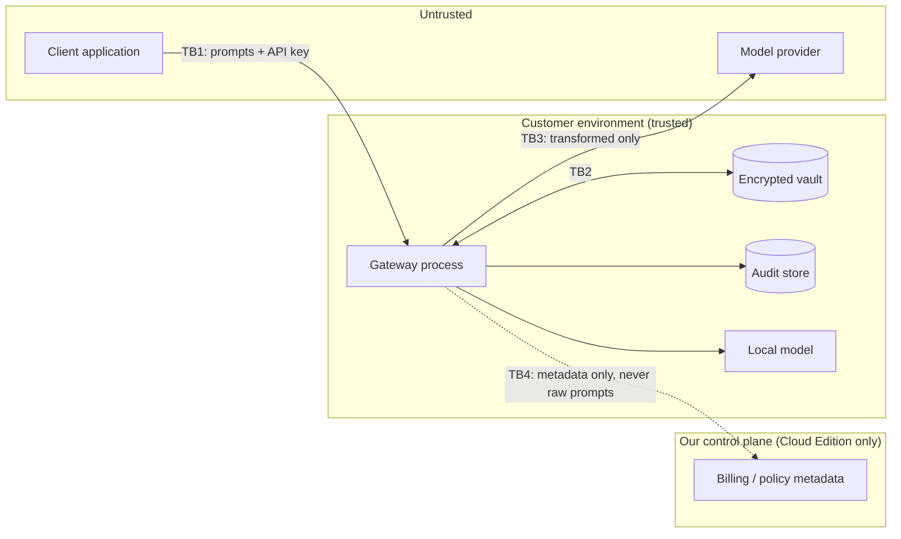

# Threat Model

**Method:** STRIDE for the data plane, with LINDDUN privacy threats where the
asset is personal data. **Status:** `REQUIRES_SECURITY_REVIEW` — this is an
engineering threat model, not an independent assessment. Security invariant SI-18
forbids any production claim before external review.

The invariants themselves now live in
[docs/security-invariants.md](security-invariants.md), with their enforcement
points, owners, and honest status. This document covers **who is attacking, with
what capability, and what stops them**.

## Assets, ranked by what a breach would cost us

| # | Asset | Why it ranks here |
|---|---|---|
| A1 | **Surrogate mappings** (token → real value) | A concentrated, structured index of exactly the data customers gave us to protect |
| A2 | **Provider credentials** | Direct financial loss and third-party impact |
| A3 | **Raw prompt content in flight** | The data itself |
| A4 | **Vault / token encryption keys** | Compromise makes A1 readable in bulk |
| A5 | **Gateway API keys** | Authenticated access to A1 and A3 |
| A6 | **Policy configuration** | Silent downgrade of every other control |
| A7 | **Audit evidence** | The proof the product worked |
| A8 | **Tenant isolation boundary** | One failure discredits the whole product |

## Trust boundaries

**TB1** — client input is attacker-controlled, always.
**TB2** — the highest-value internal boundary.
**TB3** — the boundary the product exists to defend.
**TB4** — must remain metadata-only, and must never be on the critical path
(invariant SI-15).

The complete stage-by-stage path across these boundaries, with the inspection
function and failure behaviour at each hop, is
[docs/data-flow.md](data-flow.md).

---

## Attacker capabilities

Threats below are written against these actors. Each has a **stated capability
ceiling**: the point beyond which we do not claim to defend, so a reader can
tell the difference between a control we have and a risk we accept.

### A. Prompt author — the primary attacker

**Has:** the ability to put arbitrary text into a prompt, and to read the
response. This includes any end user of the customer's application, and anyone
who can get text in front of it — a document, an email, a support ticket.

**Does not have:** the gateway's API key, the token key, the vault key, network
position, or knowledge of what other users sent.

**Can attempt:** T1 (token replay and forgery), T4 (Unicode evasion), T5 (prompt
injection), T9 (oversized input, ReDoS via customer patterns), T16 (inducing the
model to emit sensitive data).

**This is the actor the product is designed against.** Everything in
[SI-01](security-invariants.md#si-01--no-uninspected-egress),
[SI-02](security-invariants.md#si-02--reject-unknown-content),
[SI-03](security-invariants.md#si-03--current-request-restoration-only), and
[SI-17](security-invariants.md#si-17--original-text-integrity) exists for them.

### B. Authenticated tenant

**Has:** a valid gateway API key, and therefore a tenant scope.

**Does not have:** another tenant's key, or access to the host.

**Can attempt:** T2 (cross-tenant mapping access), T3 (collision), T12 (replay
across time).

**Ceiling:** in the Community Edition a tenant is a logical label on a key, and
the deployment is single-customer. Genuine multi-tenant defence is a **hosted
edition** requirement and is not claimed here — see `docs/tenant-isolation.md`.

### C. Model provider

**Has:** everything sent across TB3, and full control of the response.

**Can attempt:** returning tokens the gateway did not mint, returning tokens in
unexpected fields, returning oversized or malformed responses, and correlating
deterministic pseudonyms across requests.

**Ceiling:** we assume the provider is *curious*, not *actively hostile with
knowledge of our keys*. Deterministic pseudonyms leak equality — a provider can
tell that two requests concerned the same person without learning who. This is
a deliberate trade for multi-turn usability, and it is stated rather than
hidden.

### D. Operator

**Has:** environment variables, the policy file, and the host.

**Can cause:** T6 (SSRF via a misconfigured base URL), T15 (unsafe policy
update), key mishandling.

**Ceiling:** the operator is **trusted**. A malicious operator defeats the
product entirely, and no control here changes that. The controls that exist —
policy versioning in every audit event, a required catch-all rule, loud warnings
on ephemeral keys — target the *mistaken* operator, which is the realistic case.

### E. Network attacker

**Has:** a position between the gateway and the provider.

**Mitigated by:** TLS verification and `trust_env=False`, so an ambient proxy
variable cannot silently insert a hop.

**Ceiling:** no certificate pinning. An attacker holding a trusted CA is out of
scope.

### F. Supply-chain attacker

**Can attempt:** T13, via a dependency, a base image, or a model artefact.

**Ceiling:** minimal dependency set and a licence-boundary test today. **SBOM,
image signing, and build provenance do not exist yet** — so this actor is
currently defended against by having a small attack surface, not by verification.

---

## Threat register

Likelihood/impact: L/M/H. "Test" names the enforcing test where one exists.

### T1. Restoration of attacker-supplied tokens ⭐ *the defining threat*

| | |
|---|---|
| **Asset** | A1 |
| **Attacker** | Any authenticated user of the customer's application, or anyone who can inject text into a prompt |
| **Path** | User observes `<PERSON:...>` in a response, then writes a token into a later prompt hoping the gateway expands it |
| **Likelihood / Impact** | **H / H** |
| **Mitigation** | (1) HMAC-derived token tag over (tenant, conversation, entity, value) — unguessable; (2) per-request **provenance set** — a token not minted by *this* request is never restored |
| **Residual risk** | Low. An attacker who compromises the token key *and* the vault defeats it — but that is a key-compromise scenario, not this one |
| **Test** | `tests/test_restoration_safety.py::TestAttackerInjectedTokens` (4 tests) |
| **Detection** | `tokens_refused > 0` in audit events; alert on a sustained rate |

This threat is why restoration checks request-local provenance as well as vault
scope. Vault scope alone would still permit replay within one conversation.

### T2. Cross-tenant mapping access

| | |
|---|---|
| **Asset** | A1, A8 |
| **Attacker** | A malicious or compromised tenant |
| **Path** | Present a token belonging to tenant A while authenticated as tenant B |
| **Likelihood / Impact** | M / **H** |
| **Mitigation** | Tenant id is (1) part of the vault storage key, (2) bound into the AEAD additional data so a misdirected blob **fails to decrypt**, (3) re-checked on the decrypted plaintext. Cryptographic, not merely control-flow |
| **Residual risk** | Low |
| **Test** | `TestCrossTenantIsolation` (3), `test_api_e2e.py::TestTenantIsolationOverHttp` (2) |
| **Detection** | `CrossTenantAccessError` — should be **exactly zero**; page on any occurrence |

### T3. Token collision

| | |
|---|---|
| **Asset** | A1 |
| **Path** | Two distinct values produce the same tag, so restoration returns the wrong person's data |
| **L / I** | L / H |
| **Mitigation** | 128-bit HMAC-SHA256 tag, plus an **explicit collision check** in `TokenMinter.mint` that raises `TokenCollisionError` rather than silently overwriting |
| **Residual** | Very low |
| **Test** | `test_properties_and_fuzz.py` round-trip properties; `test_vault_hardening.py::TestTokenCollision` |

### T4. Unicode / homoglyph evasion

| | |
|---|---|
| **Asset** | A3 |
| **Path** | Fullwidth digits, ligatures, or homoglyphs make a personal code invisible to `[0-9]` while remaining readable to a human |
| **L / I** | M / H |
| **Mitigation** | Detection runs on a normalised **view** — invisibles dropped, NFKC per cluster, confusables folded — with a reversible offset map, so spans are replaced in the original and the replacement *includes* the evasion characters. Bidi controls and dense invisible padding are refused outright with an audit reason code and no content |
| **Residual** | **Low.** Measured: adversarial recall 33% → **100%** on Latvian codes and 0% → **100%** on emails, with no new false positives on the boundary corpus. Remaining gap is multi-character confusables (`œ` → `oe`), deliberately out of scope — see ADR-0015 |
| **Test** | `tests/test_normalization.py` (~100), `evals/leakage/...::TestUnicodeEvasion` (4), `evals/test_detection_baseline.py::TestAdversarialGapIsClosed` |
| **Status** | **Closed by Phase 4.** R-04 can be retired from the risk register |

### T5. Prompt injection / tool-call injection

| | |
|---|---|
| **Asset** | A3, A6 |
| **Path** | Prompt content instructs the model to exfiltrate, or poisons tool arguments |
| **L / I** | H / M |
| **Mitigation** | Our controls are **data-flow**, not intent-based: detected prompt values are transformed before the provider sees them, and restoration expands only tokens minted by the current request |
| **Residual** | **Medium.** We do not claim to prevent prompt injection, and must not market as if we do. We reduce its *consequences* |
| **Gap** | Tool calls and structured output are **not inspected in v1** — but they are now **refused**, not forwarded. `tools`, `functions`, `response_format`, and message-level `tool_calls`/`name` all return 422 `uninspectable_field`. Closed by Phase 5; inspecting them rather than refusing them remains future work |
| **Test** | `TestFailClosed::test_non_text_content_is_refused_not_forwarded` |

### T6. SSRF via configurable base URLs

| | |
|---|---|
| **Asset** | A2, infrastructure |
| **Path** | An operator (or a compromised control plane) sets a provider base URL to `169.254.169.254` or an internal address, turning the gateway into a request proxy |
| **L / I** | M / H |
| **Mitigation** | Destinations are operator-configured and selected by name — a client cannot supply a URL, and the typed request model rejects any field that looks like one. `EgressPolicy` validates scheme, an optional host allowlist, and every resolved address, refusing loopback, link-local, private, reserved, and multicast. Validated at startup **and** per request. Redirects not followed, TLS verification explicit, `trust_env=False`, responses capped at 8 MiB |
| **Residual** | **Low.** httpx resolves again when it connects, so fast DNS rebinding remains open — closing it needs a transport pinned to the validated address. Documented in `gateway/routing/egress.py` and raised for the independent review |
| **Test** | `tests/test_egress_and_retry.py::TestEgressPolicy`, `::TestClientsCannotChooseAnUpstream` |
| **Status** | **Closed by Phase 5.** R-02 can be retired |

### T7. Provider credential leakage through logs or errors

| | |
|---|---|
| **Asset** | A2 |
| **Path** | An httpx exception string containing the request URL (with credentials) is logged or returned |
| **L / I** | M / H |
| **Mitigation** | `ProviderError` deliberately excludes `str(exc)` and the response body; only the exception *type* and status code are surfaced |
| **Test** | `test_audit_and_logging.py::test_provider_error_does_not_include_credentials` |

### T8. Raw content in logs, traces, or backups

| | |
|---|---|
| **Asset** | A3 |
| **L / I** | M / H |
| **Mitigation** | `AuditEvent` is a closed, slotted dataclass with **no `extra`/`metadata` dict** — there is no field through which prompt text can be added later without a code review that changes the class |
| **Test** | Canary tests (`test_audit_contains_no_raw_content`), plus a structural test asserting no extensible field exists |
| **Residual** | Low for audit; **Medium for tracing** — OpenTelemetry spans are not yet implemented and must be built redaction-first |

### T9. Denial of service via huge prompts / catastrophic regex

| | |
|---|---|
| **Asset** | availability |
| **Path** | A 100 MB prompt, or a customer regex like `(a+)+` evaluated against attacker text |
| **L / I** | M / M |
| **Mitigation** | `SAG_MAX_INPUT_CHARS` (default 64k; 256k cost 558 ms of CPU per request, letting one tenant hold an instance at ~2 rps with legitimate traffic) enforced during inspection; customer patterns are length-capped and screened for nested unbounded quantifiers; container memory limit of 1 GB turns exhaustion into a restart |
| **Residual** | **Medium.** The regex screen is a heuristic, not a complete ReDoS analysis — Python's `re` has no backtracking limit |
| **Test** | `test_detectors.py::test_rejects_catastrophic_backtracking_pattern`, `test_oversized_request_is_refused` |
| **Follow-up** | Evaluate the `regex` module's timeout support, or run detection in a bounded worker. R-03 |

### T10. Detector outage → silent bypass

| | |
|---|---|
| **Asset** | A3 |
| **L / I** | M / H |
| **Mitigation** | **Fail closed.** Any detector exception raises `DetectionError` → HTTP 422, and the request is never forwarded |
| **Test** | `TestFailClosed` |
| **Note** | Deliberate asymmetry, following `llm-governance-gateway`: detection failure blocks; a future harm classifier may fail open |

### T11. Control-plane outage breaking the data plane

| | |
|---|---|
| **Asset** | availability, A8 |
| **Mitigation** | The Community Edition has **no control-plane dependency at all**. `/readyz` deliberately does not check any external service |
| **Test** | `test_api_e2e.py::test_readiness_does_not_depend_on_external_provider` |
| **Invariant** | SI-15 |

### T12. Stale mappings / replay across time

| | |
|---|---|
| **Mitigation** | TTL enforced **on read**, not only by a sweeper, so a failed sweeper cannot silently extend PII lifetime |
| **Test** | `TestExpiry` (2) |

### T13. Supply-chain compromise

| | |
|---|---|
| **L / I** | M / H |
| **Mitigation** | Minimal core dependency set (6 packages); NER and routing are optional extras; multi-stage image with no build toolchain at runtime; source SBOM and an SPDX-aware licence policy enforced in the test suite; pip-audit, Trivy and Gitleaks blocking in CI; vulnerability exceptions dated, owned, and expiring; licence-boundary test blocking proprietary `litellm-enterprise` |
| **Residual** | **Medium.** The tooling exists and **has not been executed against a real build** — the registry was unreachable here, so the container SBOM, image signature, build provenance, and image scan are all wired and unrun. The base image is still referenced by a mutable tag. R-01 |
| **Test** | `tests/test_supply_chain.py` (26), `tests/test_licence_boundary.py` (9) |

### T14. API-key theft

| | |
|---|---|
| **Mitigation** | Keys stored as SHA-256 hashes, never plaintext; constant-time comparison; prefix check before hashing |
| **Residual** | Medium — no rotation or expiry workflow yet |

### T15. Unsafe policy update

| | |
|---|---|
| **Path** | A policy edit silently downgrades protection |
| **Mitigation** | Policy version (declared or content-hash) is stamped into **every** audit event, so a change is always visible in the record; loader **refuses** a policy without a catch-all rule; deny-overrides at equal priority |
| **Test** | `test_policy_engine.py::TestValidation`, `TestVersioning` |
| **Gap** | No dry-run / simulation mode yet. R-05 |

### T16. Model-generated sensitive data in output

| | |
|---|---|
| **Path** | The model *invents* or *recalls* a plausible personal code that was never in the prompt |
| **Mitigation** | Provider responses are buffered and size-bounded before release; restoration scans only token-shaped values and expands only current-request tokens |
| **Residual** | **Medium.** General sensitive-data detection is not run on provider output, so newly generated entities are neither transformed nor blocked. Follow-up: inspect output and apply policy to its findings |

### T17. Streaming leakage

| | |
|---|---|
| **Mitigation** | Streaming is **refused** (`stream=true` → HTTP 400), not silently downgraded. An entity split across chunks cannot leak because no chunks are emitted |
| **Residual** | None today; re-opens when streaming ships, and that work needs its own review |

### T18. Equality disclosure to the model provider

| | |
|---|---|
| **Asset** | A3 |
| **Attacker** | The model provider, assumed curious rather than actively hostile |
| **Path** | Tokens are deterministic within a conversation, so repeated occurrences reveal that two mentions are the same value — plus cardinality, entity type, position, and co-occurrence structure |
| **L / I** | H / L |
| **Mitigation** | Determinism is scoped to (tenant, conversation), so nothing correlates across conversations or tenants. The tag is HMAC-derived, so the provider cannot invert it or test a guess offline. `route_local` is the answer for customers who cannot accept the residual |
| **Residual** | **Accepted, deliberately.** The only alternative that closes it — randomising per occurrence — makes multi-turn reasoning unusable. Argued in full in `docs/adr/0016-equality-leakage-of-deterministic-pseudonyms.md` |
| **Consequence** | "Pseudonymisation" must never be marketed as "anonymisation". Pseudonymised data remains personal data |

---

## Security invariants

The invariant set moved to [docs/security-invariants.md](security-invariants.md),
which carries eighteen `SI-` numbered invariants with enforcement points, tests,
owners, and status. The legacy `#1`–`#10` numbering used in earlier revisions of
this document maps to the new ids in that file; any remaining bare `#N` reference
in the tree is stale.

The repository's adversarial and property tests provide the executable coverage
for these invariants.

## Known open risks, honestly stated

The first six were known at the vertical-slice review. The last three surfaced
during the Phase 0 contract freeze and are new.

1. ~~**T4** — homoglyph and invisible-character evasion is only partly
   addressed.~~ **Closed by Phase 4.** Adversarial recall is now 100% on the
   documented techniques. The residual is multi-character confusables, which are
   out of scope by decision rather than by omission.
2. **T5** — tool calls and structured output are **refused, not inspected**.
   Closed as a leak; open as a capability.
3. ~~**T6** — no egress allowlist.~~ **Closed by Phase 5.** Residual is fast DNS
   rebinding, which needs a pinned transport.
4. **T9** — the ReDoS screen is a heuristic, and detector timeouts are not
   implemented: a hanging detector blocks until the client disconnects.
5. **T13** — supply-chain tooling is built but **unexecuted**: source SBOM and
   licence policy run and pass, but the container SBOM, image signature, build
   provenance, and image scan have never run, and the base image is not pinned
   to a digest. One machine with registry access closes all of it.
6. **T16** — output findings do not yet drive policy actions. A model that
   invents a plausible personal code is not blocked.
7. ~~**Uninspected pass-through.**~~ **Closed by Phase 5.** Unknown roles and
   unknown top-level fields are now refused, and the outbound payload is rebuilt
   from a validated model rather than copied from the client's body.
8. ~~**No vault key rotation.**~~ **Closed by Phase 3.** Records carry a key
   version; rotation is additive; a missing key raises instead of silently
   failing to restore.
9. ~~**Retry and concurrency behaviour is untested.**~~ **Closed by Phases 3 and
   5.** Concurrency, cancellation, and retry are enforced and tested.
10. **Error paths write no audit event (new).** A request refused for
    un-inspectable content or a provider failure leaves no record an operator
    can query. [SI-13](security-invariants.md#si-13--security-critical-actions-produce-audit-evidence);
    Phase 6.
11. **Container hardening is unverified (new).** The tests exist and have never
    run — the Docker registry was unreachable in our environment. They must run
    once before the container claims count as evidence.

None of these is hidden by a passing test. Each remains an explicit limitation
until the corresponding mitigation has evidence.

## Threats without a mapped invariant

Stated so the coverage claim is checkable rather than assumed:

| Threat | Covering invariant |
|---|---|
| T1 Token replay | SI-03, SI-06 |
| T2 Cross-tenant access | SI-04, SI-05 |
| T3 Token collision | SI-06 |
| T4 Unicode evasion | SI-17 |
| T5 Prompt/tool injection | SI-01, SI-02 |
| T6 SSRF | SI-14 |
| T7 Credential leakage | SI-12 |
| T8 Raw content in logs | SI-11 |
| T9 DoS | SI-02 (size limit), SI-10 (timeouts — **not implemented**) |
| T10 Detector outage | SI-10 |
| T11 Control-plane outage | SI-15 |
| T12 Stale mappings | SI-03 (TTL is a supporting control, not the primary one) |
| T13 Supply chain | **none** — release-engineering gate, not a request-path invariant |
| T14 API-key theft | **none** — no rotation or expiry workflow exists |
| T15 Unsafe policy update | SI-13 (policy version in every audit event) |
| T16 Model-generated data | **none** — output findings do not drive policy |
| T17 Streaming leakage | SI-02 (refused) |
| T18 Equality disclosure | **none** — accepted residual, ADR-0016 |

The three threats with no covering invariant are deliberate: T13 is closed by
build process rather than runtime behaviour, and T14 and T16 are **genuine gaps**
that need either an invariant or a written acceptance before Community Edition
beta.
